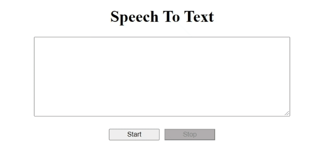

## Speech-To-Text

Google's speech to text (STT) API used along with RecordRTC.js library. It will take audio from the microphone and passes the audio data (blob) to the Google API. 

## Compatibility Instructions:

It will work on all the latest browsers.

Note: Always run project under "https:" protocol because it will not allow to pass audio data from Microphone if not in secure channel. 

## Google Speech API Access

Before you can send a request to the Speech-to-Text API, you must have completed the following actions. 

- Enable Speech-to-Text on a GCP project.
- Make sure billing is enabled for Speech-to-Text.
- Create and/or assign one or more service accounts to Speech-to-Text.
- Download a service account credential key.
- Set your authentication environment variable.

## Setting up the environment

For Windows user - Open Power Shell (Set the below env)

$env:GOOGLE_APPLICATION_CREDENTIALS="..\google-credential-file-path.json"

